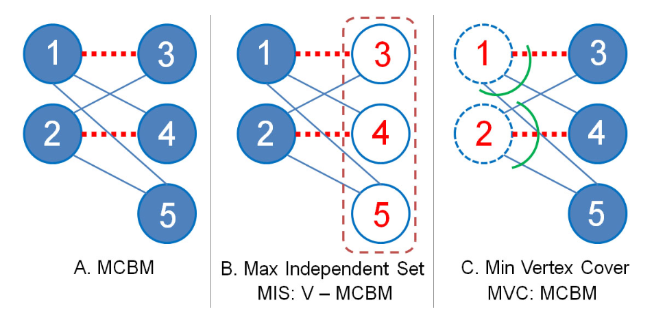

# Bipartite graph

A graph is bipartite when the set of vertices V can be partitioned into two disjoint sets LV (left vertices) and RV (right vertices), and, for all edges (l,r) of E, l is in LV and r is in RV.

Ou seja, um grafo é bipartido se pode ser "pintado" em apenas duas cores sem que vértices adjacentes tenham a mesma cor.

The graph is 2-colourable (bipartite) if there is no cycle with an odd length.

## Max Independent Set and Min Vertex Cover on Bipartite Graph

An Independent Set (IS) of a graph G is a subset of the vertices such that no two vertices in the subset represent an edge of G. A Max IS (MIS) is an IS such that adding any other vertex to the set causes the set to contain an edge. In Bipartite Graph, the size of the MIS + MCBM = V . Or in another word: MIS = V - MCBM. In Figure 4.43.B, we have a Bipartite Graph with 2 vertices on the left side and 3 vertices on the right side. The MCBM is 2 (two dashed lines) and the MIS is 5-2 = 3. Indeed, {3, 4, 5} are the members of the MIS of this Bipartite Graph. Another term for MIS is Dominating Set.

Max Independent Set: max(|RV|, |LV|) = |V| - MCBM
